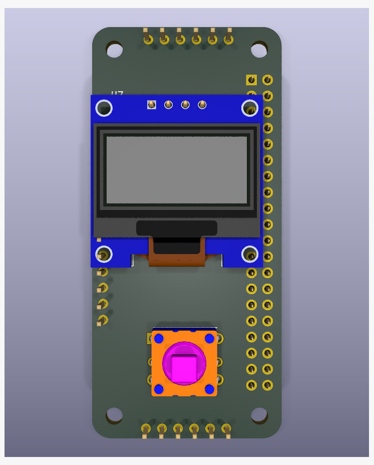
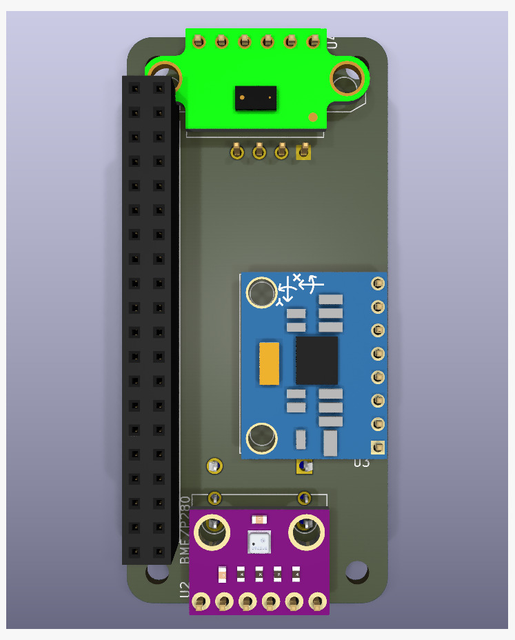
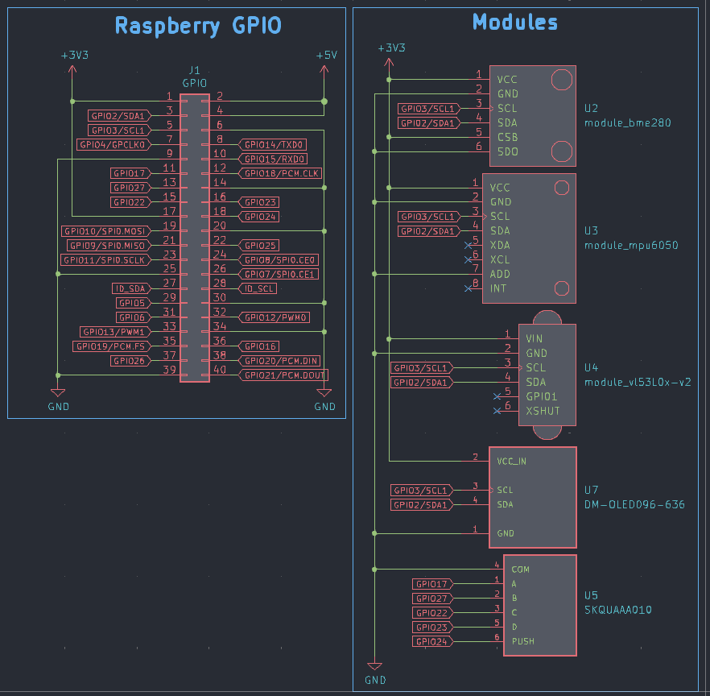
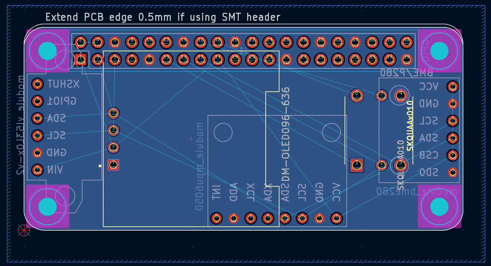

# Alex Pi HAT

A Raspberry Pi HAT designed as a handheld topography device, integrating multiple sensors and an OLED display for terrain mapping, elevation tracking, and environmental sensing.

## Features

- **BME280** - Temperature, humidity, and barometric pressure sensor (for altitude estimation)
- **MPU6050** - 6-axis accelerometer and gyroscope for orientation and tilt sensing
- **VL53L0X** - Time-of-Flight distance sensor (up to 2m range) for terrain profiling
- **0.96" OLED Display** - 128x64 I2C monochrome display for real-time topographic data visualization
- **User Button** - Programmable tactile switch for data capture and mode selection
- **4x M2.5 Mounting Holes** - Standard Pi HAT mechanical compatibility

## Hardware Specifications

- **Form Factor**: Raspberry Pi HAT (standard 40-pin GPIO connector)
- **Communication**: I2C bus (shared by all sensors)
- **Power**: Powered directly from Raspberry Pi 3.3V/5V rails

## Schematic & Layout

## Applications

- Handheld terrain mapping and topographic surveying
- Elevation profiling and altitude tracking
- Trail mapping and outdoor navigation
- Geological surveying
- Cave exploration and mapping
- Construction site surveys
- Environmental field research

## Design Files

This project was designed using KiCad 9.0. All design files are included:

- Schematic: `alex-pi-hat.kicad_sch`
- PCB Layout: `alex-pi-hat.kicad_pcb`
- Custom footprints and symbols in `Imports/`

## License

[Add your license here]
